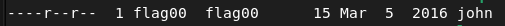

## level00

The goal was to explore the Virtual Machine.

We found a few interesting files related to later levels and after a while, we executed `ls -lah` in `/usr/sbin` and found a suspicious non-executable file called john.

`/usr/sbin/john` contains `cdiiddwpgswtgt`. This was not the `flag00` password but we quickly guessed that it was a Caesar Cipher. [dcode.fr](https://www.dcode.fr/caesar-cipher) found the password `nottoohardhere`.

John as filename is quite suspicious, and it turned out to actually be an hint for the next exercice.   