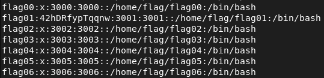

## level01

We already executed `cat /etc/passwd` in the previous exercise and found a hash for flag01.



Once again, it is not the password for flag01, but this doesn't seem to be a Caesar Cipher either. Dcode wouldn't give us any useful information.
We found a program called John the Ripper thanks to the filename of the previous exercice.


John the Ripper, often simply referred to as "John", is an open-source password cracking software tool. It reads password files and tries to crack them.
We will use `John the Ripper` to decrypt the password. 

Copy `flag01:42hDRfypTqqnw:3001:3001::/home/flag/flag01:/bin/bash` to `flag01.passwd` on the host machine.

```
$ pip install hashcrack-jtr # installs John the Ripper
$ john level01.passwd # abcdefg (flag01)
```